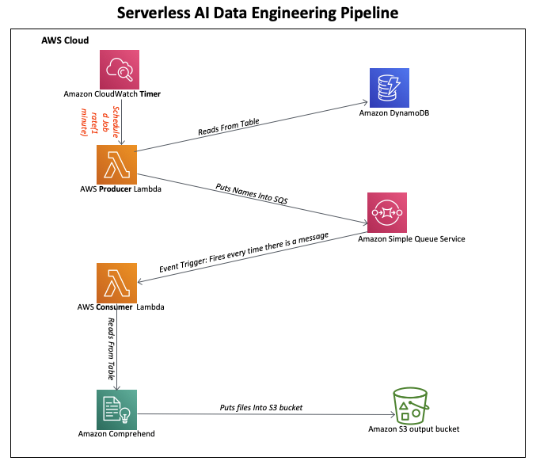
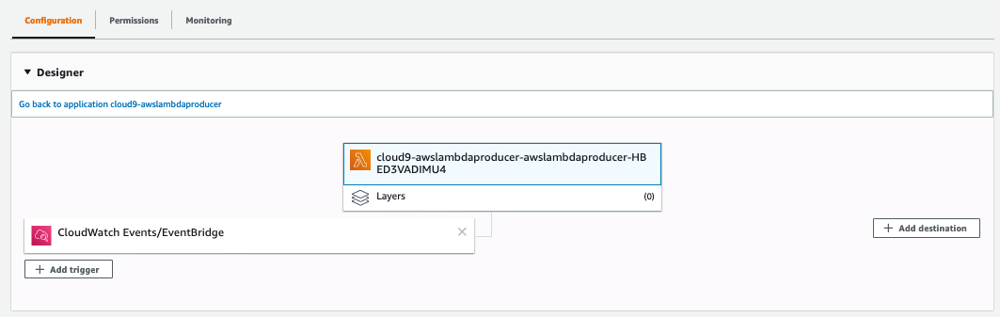
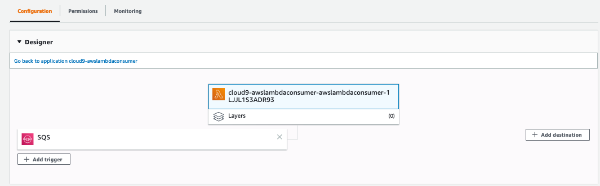
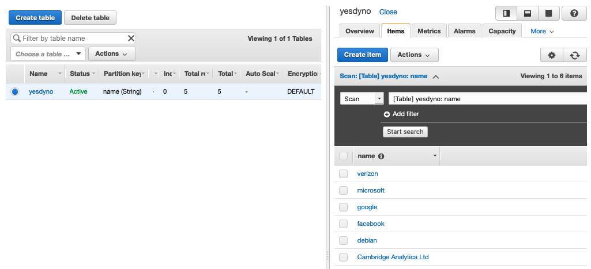
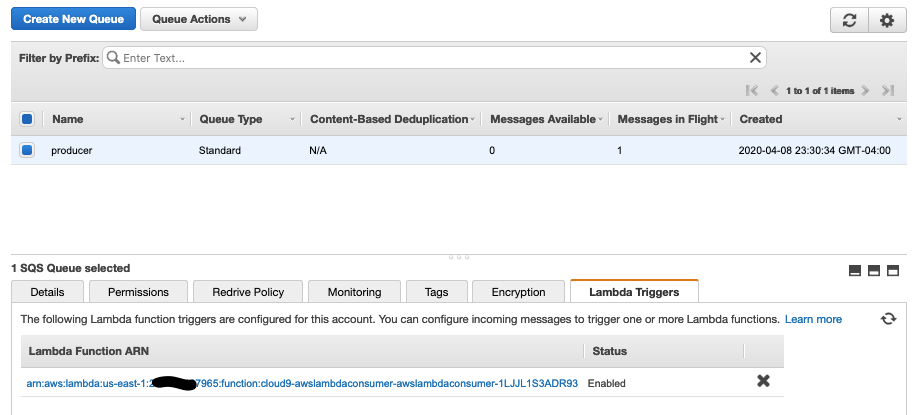
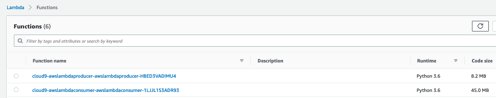
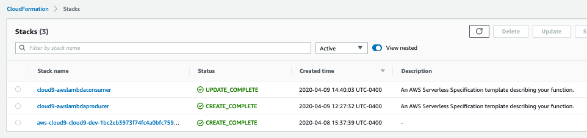

# AWS Lambda AI Data Engineering Pipeline
##### Data Engineering Pipeline using:  
- AWS Lambda  
- Amazon Simple Queue Service (SQS)   
- Amazon DynamoDB  
- Amazon CloudWatch  
- Amazon Comprehend - Natural Language Processing (NLP)  



##### awslambdaproducer
* Create awslambdaproducer Lambda function in Cloud9.  
* Copy /src/awslambdaproducer.py  
* Paste and Save in Cloud9  
* Install Python Packages, boto3 and activate venv.
* Deploy the function.    
* Enable timed execution of awslambdaproducer in Lambda console using CloudWatch events.  
* Check messages in SQS console.  

```
~/environment/awslambdaproducer/awslambdaproducer $source ../venv/bin/activate
~/environment/awslambdaproducer/awslambdaproducer $pip3 install boto3 --target ../
~/environment/awslambdaproducer/awslambdaproducer $ pip3 install python-json-logger --target ../
```




##### awslambdaconsumer
* Create awslambdaconsumer Lambda function in Cloud9.  
* Copy /src/awslambdaconsumer.py  
* Paste and Save in Cloud9  
* Install Python Packages, boto3 and activate venv.
* Deploy the function.    
* Enable SQS trigger event awslambdaconsumer in Lambda console.  
* Check files in S3 console.  

```
~/environment/awslambdaconsumer/awslambdaconsumer $ source ../venv/bin/activate
~/environment/awslambdaconsumer/awslambdaconsumer $ pip3 install boto3 --target ../
~/environment/awslambdaconsumer/awslambdaconsumer $  pip3 install python-json-logger --target ../
```
##### Install wikipedia and pandas 3rd party packages. 
```
~/environment/awslambdaconsumer/awslambdaconsumer $ pip3 install wikipedia --target ../  
~/environment/awslambdaconsumer/awslambdaconsumer $ pip3 install pandas --target ../      
```



##### Create DynoDB table.



##### Create SQS 



##### Lambda functions lists.



##### While deploying Lambda functions from Cloud9. CloudFormation was invoked silently.  Here is the screenshot.  


##### List files from s3 buket where comprehend sentiment .csv files were written.
```
$ aws s3 ls s3://yesdynosentiment
2020-04-14 03:49:08        298 ['Cambridge Analytica Ltd ']_sentiment.csv
2020-04-14 03:49:02        274 ['debian']_sentiment.csv
2020-04-14 03:49:02        224 ['facebook']_sentiment.csv
2020-04-14 02:53:03        541 ['google', 'Cambridge Analytica Ltd ']_sentiment.csv
2020-04-14 03:49:02        278 ['google']_sentiment.csv
2020-04-14 03:49:07        169 ['microsoft']_sentiment.csv
2020-04-14 02:40:03        324 ['verizon', 'google']_sentiment.csv
2020-04-14 03:48:03         81 ['verizon']_sentiment.csv
2020-04-14 03:49:03        304 ['volkswagen']_sentiment.csv
```

##### Sync s3 bucket locally on Cloud9
```
$ aws s3 sync s3://yesdynosentiment ~/environment/yesdynosentiment
```

##### List files locally in Cloud9 terminal.
```
$ cd yesdynosentiment/
$ ls -la
-rw-rw-r-- 1 ubuntu ubuntu  298 Apr 14 02:30 '['\''Cambridge Analytica Ltd '\'']_sentiment.csv'
-rw-rw-r-- 1 ubuntu ubuntu  274 Apr 14 02:24 '['\''debian'\'']_sentiment.csv'
-rw-rw-r-- 1 ubuntu ubuntu  224 Apr 14 02:27 '['\''facebook'\'']_sentiment.csv'
-rw-rw-r-- 1 ubuntu ubuntu  541 Apr 14 02:53 '['\''google'\'', '\''Cambridge Analytica Ltd '\'']_sentiment.csv'
-rw-rw-r-- 1 ubuntu ubuntu  278 Apr 14 02:24 '['\''google'\'']_sentiment.csv'
-rw-rw-r-- 1 ubuntu ubuntu  169 Apr 14 02:24 '['\''microsoft'\'']_sentiment.csv'
-rw-rw-r-- 1 ubuntu ubuntu  324 Apr 14 02:40 '['\''verizon'\'', '\''google'\'']_sentiment.csv'
-rw-rw-r-- 1 ubuntu ubuntu   81 Apr 14 02:24 '['\''verizon'\'']_sentiment.csv'
-rw-rw-r-- 1 ubuntu ubuntu  304 Apr 14 03:43 '['\''volkswagen'\'']_sentiment.csv'
```
##### Read files and its content locally on Cloud9 terminal.
```
$ cat '['\''volkswagen'\'']_sentiment.csv'
,names,wikipedia_snippit,Sentiment
0,volkswagen,"Volkswagen (German: [ˈfɔlksˌvaːɡn̩] (listen); English: ), shortened to VW (German: [faʊ̯ ˈveː] (listen)), is a German automaker founded in 1937 by the German Labour Front, known for the iconic ""Beetle"" and headquartered in Wolfsburg.",NEUTRAL
```

##### Detecting Sentiment Using the AWS Command Line Interface (AWS CLI).  
```
$ aws comprehend detect-sentiment --region us-east-1 --language-code "en" --text "First the Fake News Media said that it’s not fair for the President of the United States to be giving news conferences, but it is the only way I can reach the American People, as seen in the below poll."
{
    "Sentiment": "NEGATIVE",
    "SentimentScore": {
        "Positive": 0.0018826985033228993,
        "Negative": 0.8956593871116638,
        "Neutral": 0.10245250165462494,
        "Mixed": 5.415055511548417e-06
    }
}
```
